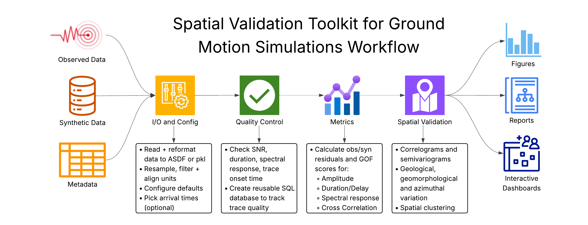

# Spatial-VTK

`spatial-vtk` provides spatial validation tools for ground-motion simulations,
with data QC, residual and metric calculations, geologic metadata integration,
spatial statistics, mapping, and dashboard preparation for understanding model
performance patterns.

## Install

Install from PyPI:

    python -m pip install spatial-vtk

Or create the conda environment and install from a source checkout:

    conda env create -f svtk_environment.yaml
    conda activate spatial-vtk
    python -m pip install -e .

The package imports as `spatial_vtk` and installs the `svtk` command:

    python -c "import spatial_vtk; print(spatial_vtk.__version__)"
    svtk --help

## Structure

- `spatial_vtk.io`: metadata preparation, input inventories, waveform
  preprocessing, manifests, and waveform format helpers.
- `spatial_vtk.config`: repository paths, bounds, and runtime settings.
- `spatial_vtk.qc`: quality-control build, review, and summary workflows.
- `spatial_vtk.metrics`: ground-motion metric and residual calculations.
- `spatial_vtk.spatial`: metric-field preparation, spatial correlation,
  PCA spatial modes, REDCAP and residual-feature clustering, geology joins,
  pattern tests, plots, and map helpers.
- `spatial_vtk.visualize`: context figures, QC views, and dashboard data.
- `spatial_vtk.cli`: command-line entry points.

See the [public documentation](https://bcbirkel.github.io/spatial-vtk/) for
installation, package overview, examples, API reference, support, and changelog
pages.
