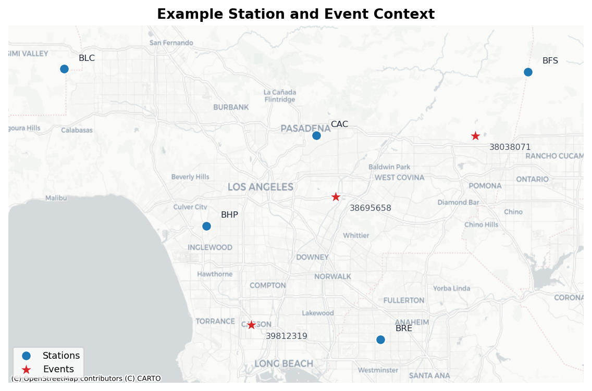
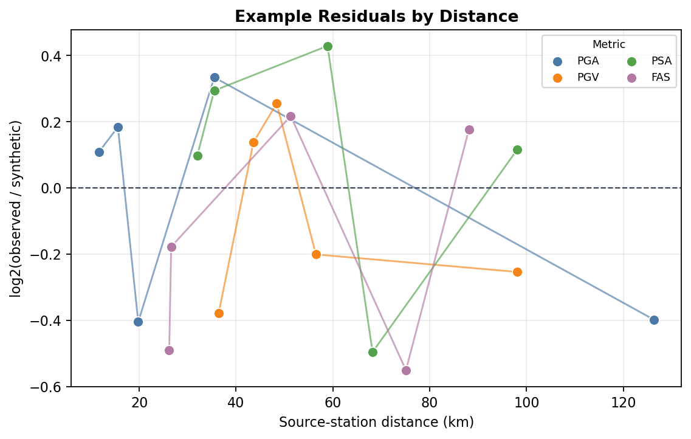
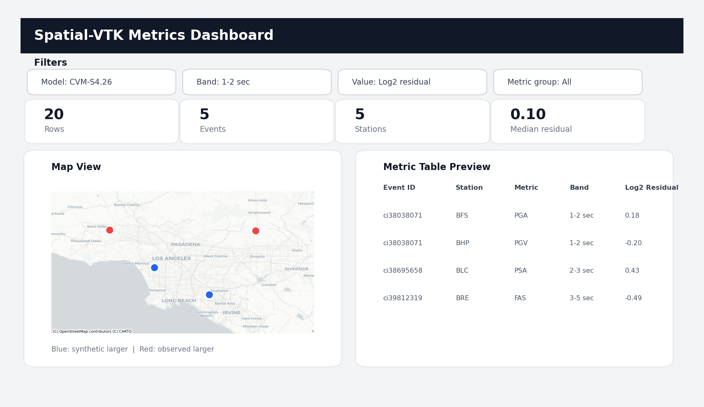

Data Formats
============

This page shows what you need before you start using Spatial-VTK and what you
can expect the toolkit to write as you move through a workflow.

Spatial-VTK does not download observed data and it does not run simulations.
You bring the observed waveforms, synthetic waveforms, and metadata; Spatial-VTK
helps you prepare them, check them, calculate metrics, analyze spatial patterns,
and make figures or dashboards. If you still need observed waveforms, start
with the `ObsPy FDSN client documentation <https://docs.obspy.org/packages/obspy.clients.fdsn.html>`__
or the `ObsPy mass downloader <https://docs.obspy.org/packages/autogen/obspy.clients.fdsn.mass_downloader.html>`__.
If you still need synthetic waveforms, look at simulation tools such as
`SPECFEM3D Cartesian <https://specfem3d.readthedocs.io/>`__ or
`Salvus <https://docs.mondaic.com/>`__.

What You Need First
-------------------

For the basic workflow, you should have these files available on disk:

Observed waveforms
   These are your recorded data. Spatial-VTK can read waveform files through
   ObsPy, so MiniSEED and SAC are good starting points. The lightweight reader
   also supports simple ``.npy`` and ``.npz`` arrays for small examples and
   tests.

Synthetic waveforms
   These are your simulated waveforms for the same events, stations, and
   components you want to compare. Normalized MiniSEED is the easiest format to
   use. ASDF is also supported when ``pyasdf`` is installed. Some Salvus-style
   outputs can be inspected and normalized, but generic HDF5 files need a
   schema-specific adapter before Spatial-VTK can calculate metrics from them.

Station metadata
   At minimum, you need station code and station coordinates. Network code is
   optional but strongly recommended because it helps avoid station-name
   collisions.

Event metadata
   At minimum, you need event ID and event coordinates. Origin time, magnitude,
   depth, mechanism, and source labels are optional but useful for filtering,
   plotting, and spatial summaries.

The observed and synthetic files do not need to have identical directory
layouts, but they do need enough metadata to match the same event, station, and
component. The first tutorial notebook will walk you through creating the
prepared station, event, event-station, and waveform inventory tables that later
steps read from disk.

Example Metadata
----------------

Spatial-VTK is intentionally forgiving about common station and event column
names. For example, station latitude can be named ``lat``, ``latitude``,
``station_lat``, ``station_latitude``, or similar common variants. During
preparation, Spatial-VTK writes consistent columns such as ``station``,
``network``, ``lat``, ``lon``, ``event_id``, ``event_lat``, and ``event_lon``.

Here is a tiny station table, adapted from the LA Basin example metadata:

:download:`Download example_stations.csv <../data/examples/data_formats/example_stations.csv>`

.. literalinclude:: ../data/examples/data_formats/example_stations.csv
   :language: text
   :lines: 1-6

Here is the matching style for event metadata:

:download:`Download example_events.csv <../data/examples/data_formats/example_events.csv>`

.. literalinclude:: ../data/examples/data_formats/example_events.csv
   :language: text
   :lines: 1-4

The source checkout includes lightweight LA Basin example metadata under
``data/examples/la_basin_five_event_subset/metadata/`` plus a dataset manifest
that describes the companion five-event waveform bundle used by the tutorial
notebooks. Keep the manifest in git; download or generate the larger observed
waveform products and synthetic MiniSEED files separately before running the
full tutorial workflow end to end.

:download:`Download the example dataset manifest <../data/examples/la_basin_five_event_subset/metadata/example_dataset_manifest.json>`

Optional Inputs
---------------

You can run a basic metric workflow with waveforms plus event and station
metadata. The optional inputs below unlock more useful QC, mapping, and spatial
analysis.

Waveform inventory tables
   These tables point to waveform files and usually include ``source``,
   ``event_id``, ``station``, ``component``, ``model``, ``waveform_path``,
   sampling information, and optional synthetic maximum frequency. Spatial-VTK
   can build lightweight inventories from folders, and you can also provide
   your own.

:download:`Download example_waveform_inventory.csv <../data/examples/data_formats/example_waveform_inventory.csv>`

.. literalinclude:: ../data/examples/data_formats/example_waveform_inventory.csv
   :language: text
   :lines: 1-5

QC tables
   QC tables let the metric workflow skip traces or spectral periods that did
   not pass your quality rules. They usually include source, event, station,
   component, passband or period, metric group, QC status, and a short reason.
   Waveform QC can also publish a side-specific valid metric interval through
   ``valid_start_rel_s`` and ``valid_end_rel_s`` plus optional inclusive and
   exclusive sample bounds, ``valid_start_sample`` and ``valid_end_sample``.
   Metric workflows use those windows to exclude filter-edge and other
   transient-invalid samples before calculating metrics. The waveform-QC
   signal window follows the same valid-interval contract; its SNR noise window
   may extend outside the valid interval so noisy pre-signal data can lower SNR
   instead of becoming an ``insufficient_noise_window`` failure. When an
   arrival-pick catalog is supplied, waveform QC uses a picker onset only if
   its signal window has enough finite samples in the valid interval; otherwise
   it falls back to the waveform-envelope onset.

:download:`Download example_qc_summary.csv <../data/examples/data_formats/example_qc_summary.csv>`

.. literalinclude:: ../data/examples/data_formats/example_qc_summary.csv
   :language: text
   :lines: 1-5

Station or event subsets
   Simple CSV lists are useful when you want to run a notebook or command on a
   smaller set of events or stations before scaling up.

:download:`Download example_station_subset.csv <../data/examples/data_formats/example_station_subset.csv>`

.. literalinclude:: ../data/examples/data_formats/example_station_subset.csv
   :language: text
   :lines: 1-5

:download:`Download example_event_subset.csv <../data/examples/data_formats/example_event_subset.csv>`

.. literalinclude:: ../data/examples/data_formats/example_event_subset.csv
   :language: text
   :lines: 1-4

Site, geology, and geomorphology metadata
   These can be CSV or Parquet tables joined by station, event, or polygon
   labels. Typical columns might include Vs30, geologic unit, geomorphology
   class, basin zone, elevation, mapped region codes, mapped region long names,
   or other features you want to compare against residual patterns.

:download:`Download example_site_metadata.csv <../data/examples/data_formats/example_site_metadata.csv>`

.. literalinclude:: ../data/examples/data_formats/example_site_metadata.csv
   :language: text
   :lines: 1-5

GeoJSON files
   GeoJSON polygons are used for region membership, geologic classes, path
   crossings, corridor analysis, and region-based summaries. Feature
   properties should include clear labels such as ``region_name``,
   ``region_group``, ``geology_class``, or any other class name you want to use
   later. You can create custom GeoJSON files with tools such as
   `geojson.io <https://geojson.io/>`__, including by drawing polygons or
   converting other geospatial files.

Here is a compact GeoJSON example with two polygon features:

:download:`Download example_path_regions.geojson <../data/examples/data_formats/example_path_regions.geojson>`

.. literalinclude:: ../data/examples/data_formats/example_path_regions.geojson
   :language: json
   :lines: 1-39

----

Expected Outputs
----------------

Spatial-VTK writes ordinary files so you can inspect them, reuse them in later
notebooks, or open them in other tools. Most tabular outputs can be written as
CSV or Parquet. Parquet is usually better for large metric tables and dashboard
datasets; CSV is easier to preview and share in small examples.

Prepared inputs
   The first workflow steps write cleaned station tables, event tables,
   event-station tables, and waveform inventories. These are the handoff files
   that keep notebooks independent from hidden in-memory state.

:download:`Download example_prepared_stations.csv <../data/examples/data_formats/example_prepared_stations.csv>`

.. literalinclude:: ../data/examples/data_formats/example_prepared_stations.csv
   :language: text
   :lines: 1-5

QC outputs
   QC steps write trace inventories, QC summaries, rejected/accepted counts,
   sample lists for review, and manual-review queues. Manual-review queues are
   small CSV or JSON files that can be read by the manual QC picker.

:download:`Download example_manual_review_queue.csv <../data/examples/data_formats/example_manual_review_queue.csv>`

.. literalinclude:: ../data/examples/data_formats/example_manual_review_queue.csv
   :language: text
   :lines: 1-3

Metric tables
   The central output is a long metric table. A typical row represents one
   event, station, component, model, passband, metric, and sometimes one
   spectral period. The row can include observed metric values, synthetic metric
   values, observed-minus-synthetic residuals, log residuals, GOF scores,
   side-specific QC status, event metadata, station metadata, and path geometry
   such as distance and azimuth.

:download:`Download example_metrics_snapshot.csv <../data/examples/data_formats/example_metrics_snapshot.csv>`

.. literalinclude:: ../data/examples/data_formats/example_metrics_snapshot.csv
   :language: text
   :lines: 1-5

Spatial outputs
   Spatial-statistics steps write tables for station bias, event-centered
   residuals, distance-bin correlations, Moran tests, clusters, PCA spatial
   modes, geology or region summaries, path crossings, and corridor selections.

:download:`Download example_spatial_summary.csv <../data/examples/data_formats/example_spatial_summary.csv>`

.. literalinclude:: ../data/examples/data_formats/example_spatial_summary.csv
   :language: text
   :lines: 1-4

Figures and maps
   Plotting and mapping functions write standard image files, usually PNG for
   quick review and PDF when you need a vector-friendly figure. Map examples
   use ``contextily`` to fetch basemap tiles when you render the figure, so you
   need network access or a local tile cache for basemap-backed maps.

   A simple station/event context figure helps you check that your coordinates
   and IDs look sensible before running expensive calculations.

   Metric and spatial plots summarize how observed/synthetic differences vary
   with distance, period band, station, event, model, or metadata class.

Dashboard outputs
   Dashboard preparation writes the datasets needed by the Streamlit dashboards.
   The dashboards themselves are interactive local pages: you can filter by
   model, band, metric, value column, event, station, and other metadata, then
   export the filtered rows for follow-up work.

   Dashboard datasets feed interactive Streamlit pages for exploring metric
   rows, maps, summaries, and filtered exports.

The next page, Configuration, will show how to point Spatial-VTK at these files
without hard-coding paths throughout your notebooks.
